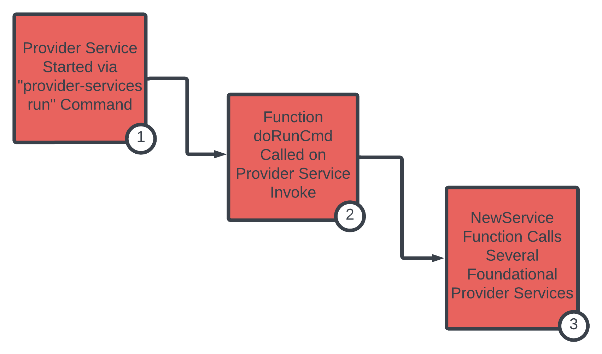

# Akash Provider Service and Associated Sub Services

## Overview

Our focus in this section centers on foundational elements of the Akash Provider service and associated sub-services.  The content reviews the processes launched and logic initiated when an Akash Provider is initialized with the `provider-services run` command.

The following Akash Provider services are explored:

* Akash Provider Service
* Bid Engine Service
* Cluster Service
* Manifest Service

## Visualization

> Use the visualization coupled with the Code Review section for correlated code deep dive

<figure><figcaption></figcaption></figure>

## Code Review

### 1). Provider Service Started via "provider-services run" Command

The Akash Provider command is registered via Cobra allowing initiation of the provider service via provider-services run via the Akash CLI.

> [Source code reference location](https://github.com/akash-network/provider/blob/e7aa0b5b81957a130f1dc584f335c6f9e41db6b1/cmd/provider-services/cmd/run.go)

When the Provider service is initiated - via the `run` command - the `doRunCmd` function is called.

```
func RunCmd() *cobra.Command {
	cmd := &cobra.Command{
		Use:          "run",
		Short:        "run akash provider",
		SilenceUsage: true,

		RunE: func(cmd *cobra.Command, args []string) error {
			return common.RunForeverWithContext(cmd.Context(), func(ctx context.Context) error {
				return doRunCmd(ctx, cmd, args)
			})
		},
	}
```

### 2). Function doRunCmd Called on Provider Service Invoke

Within the `doRunCmd` function the method `NewService` is called.

The `NewService` method is defined in `provider/service.go`.

```
	service, err := provider.NewService(ctx, cctx, info.GetAddress(), session, bus, cclient, ipOperatorClient, operatorWaiter, config)
	if err != nil {
		return err
	}
```

### 3). NewService Function Calls Several Foundational Provider Services

The `NewService` function initiates various services required by a running Akash Provider.

> [Source code reference location](https://github.com/akash-network/provider/blob/e7aa0b5b81957a130f1dc584f335c6f9e41db6b1/service.go#L57)

```
func NewService(ctx context.Context,
	cctx client.Context,
	accAddr sdk.AccAddress,
	session session.Session,
	bus pubsub.Bus,
	cclient cluster.Client,
	ipOperatorClient operatorclients.IPOperatorClient,
	waiter waiter.OperatorWaiter,
	cfg Config) (Service, error)
```

The `NewService` function calls several subordinate `NewService` functions to initiate several sub-services. &#x20;

Sub-services are expanded upon in their own, individual sections.  Access these per sub-service sections via available hyperlinks.

* **Cluster Service**

```
	cluster, err := cluster.NewService(ctx, session, bus, cclient, ipOperatorClient, waiter, clusterConfig)
	if err != nil {
		cancel()
		<-bc.lc.Done()
		return nil, err
	}
```

* **BidEngine Service**

```
	bidengine, err := bidengine.NewService(ctx, session, cluster, bus, waiter, bidengine.Config{
		PricingStrategy: cfg.BidPricingStrategy,
		Deposit:         cfg.BidDeposit,
		BidTimeout:      cfg.BidTimeout,
		Attributes:      cfg.Attributes,
		MaxGroupVolumes: cfg.MaxGroupVolumes,
	})
```

* **Manifest Service**

```
	manifest, err := manifest.NewService(ctx, session, bus, cluster.HostnameService(), manifestConfig)
	if err != nil {
		session.Log().Error("creating manifest handler", "err", err)
		cancel()
		<-cluster.Done()
		<-bidengine.Done()
		<-bc.lc.Done()
		return nil, err
	}
```
